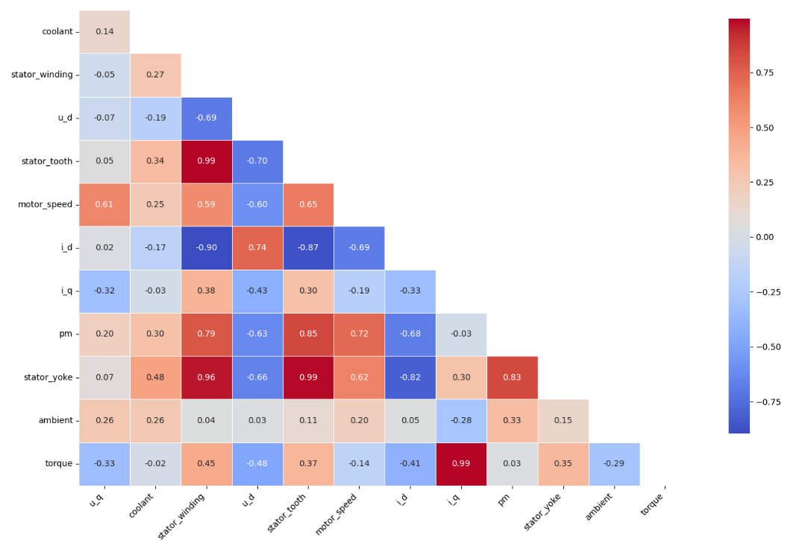

Este repositorio contiene el código y los datos utilizados para el análisis exploratorio de un dataset de motor eléctrico, enfocado en comprender los factores que influyen en el calentamiento del rotor. La visualización principal, un mapa de calor de correlación (mostrado arriba), es un punto de partida clave que resalta las relaciones entre las variables, allanando el camino para análisis más profundos, especialmente en **Power BI**.

---

## 1. Introducción

Este proyecto profundiza en el comportamiento térmico interno de un motor eléctrico, utilizando datos operativos detallados para identificar las causas del aumento de temperatura, particularmente en el rotor. El objetivo primordial es comprender estos mecanismos de calentamiento para optimizar el funcionamiento, prolongar la vida útil del motor y prevenir fallas.

## 2. Descripción del Dataset y Justificación de su Elección

El conjunto de datos proviene de Kaggle ([Electric Motor Temperature Dataset](https://www.kaggle.com/datasets/wkirgsn/electric-motor-temperature/data)) y comprende 185 horas de grabaciones de un motor síncrono de imanes permanentes (PMSM). Cada entrada representa una lectura de sensores en intervalos de 0.5 segundos (frecuencia de muestreo de 2 Hz). Incluye temperaturas (rotor, devanados, dientes y yugo del estator, refrigerante, ambiente), variables eléctricas (voltajes y corrientes de control) y parámetros operacionales (velocidad del motor y torque).

Este dataset fue seleccionado por su riqueza en variables multidimensionales y su alta resolución temporal, lo que permite un análisis detallado de las interacciones dinámicas que afectan la temperatura del motor.

## 3. Objetivo del Análisis

El propósito principal de este análisis es identificar y cuantificar la influencia de las variables operacionales, ambientales y de diseño interno del motor sobre la temperatura del rotor. Específicamente, se busca desvelar qué factores contribuyen de manera más significativa al calentamiento, con el fin de informar estrategias de monitoreo y control preventivo.

## 4. Pre-procesamiento de Datos y Transformación

Para preparar los datos para el análisis y su posterior uso en Power BI, se realizaron las siguientes operaciones:

* **Identificación y Manejo de Datos Nulos:** Se limpió una fila nula (en la columna `torque` o `profile_id`) que se encontró en el dataset, asegurando la integridad de los datos para el análisis.
* **Renombrado de Columnas:** Las columnas originales del dataset fueron renombradas a nombres más descriptivos y legibles para facilitar la comprensión y el análisis en herramientas como Power BI.

    | Columna Original   | Nueva Columna Renombrada      | Descripción                                       |
    | :----------------- | :---------------------------- | :------------------------------------------------ |
    | `u_q`              | `Voltaje_q_V`                 | Voltaje en el eje q (V)                           |
    | `coolant`          | `Temperatura_Refrigerante_C`  | Temperatura del refrigerante (Celsius)            |
    | `stator_winding`   | `Temperatura_Devanado_Estator_C` | Temperatura del devanado del estator (Celsius)   |
    | `u_d`              | `Voltaje_d_V`                 | Voltaje en el eje d (V)                           |
    | `stator_tooth`     | `Temperatura_Diente_Estator_C` | Temperatura del diente del estator (Celsius)     |
    | `motor_speed`      | `Velocidad_Motor_RPM`         | Velocidad del motor (RPM)                         |
    | `i_d`              | `Corriente_d_A`               | Corriente en el eje d (Amperios)                  |
    | `i_q`              | `Corriente_q_A`               | Corriente en el eje q (Amperios)                  |
    | `pm`               | `Temperatura_Rotor_C`         | Temperatura del rotor (Celsius)                   |
    | `stator_yoke`      | `Temperatura_Yugo_Estator_C`  | Temperatura del yugo del estator (Celsius)        |
    | `ambient`          | `Temperatura_Ambiente_C`      | Temperatura ambiente (Celsius)                    |
    | `torque`           | `Torque_Nm`                   | Torque del motor (Newton-metros)                  |
    | `profile_id`       | `ID_Sesion_Prueba`            | Identificador único de cada sesión de prueba      |
    | (calculada)        | `Tiempo_Sesion_Segundos`      | Tiempo transcurrido dentro de cada sesión (segundos) |

## 5. Principales Hallazgos / Insights

El análisis inicial de los datos reveló puntos críticos sobre el comportamiento térmico del motor:

* **Elevado Calentamiento del Rotor:** La temperatura del rotor (`Temperatura_Rotor_C`) alcanzó picos de hasta 98.10°C, y los devanados del estator (`Temperatura_Devanado_Estator_C`) hasta 141.36°C, confirmando el riesgo de sobrecalentamiento. La desviación estándar de la temperatura del rotor (~21°C) subraya su fluctuación significativa.
* **Fuerte Correlación con el Estator:** Se encontró una correlación positiva extremadamente alta (r > 0.78) entre la temperatura del rotor y las temperaturas de las distintas partes del estator (dientes, yugo y devanados). Esto indica una intensa transferencia de calor desde el estator hacia el rotor, sugiriendo que el control térmico del estator es clave.
* **Influencia de la Velocidad del Motor:** La velocidad del motor (`Velocidad_Motor_RPM`) mostró una correlación positiva significativa (r = 0.72) con la temperatura del rotor, implicando que operar a mayores RPM tiende a generar mayor calentamiento en el rotor.
* **Baja Correlación con el Torque:** Contrariamente a la intuición, el torque (`Torque_Nm`) presentó una correlación lineal muy baja (r = 0.03) con la temperatura del rotor, sugiriendo que la carga mecánica directa no es el principal impulsor lineal del calentamiento del rotor. Las variables de control eléctrico (`Corriente_d_A`, `Voltaje_d_V`) sí mostraron correlaciones negativas significativas, indicando el rol del campo magnético.

## 6. Breve Descripción de las Visualizaciones

Durante el análisis exploratorio de datos (EDA), se emplearon diversas visualizaciones para comprender y comunicar los hallazgos:
()
* **Mapas de Calor de Correlación:** Como el que se muestra al inicio de este README, fueron fundamentales para identificar rápidamente las interdependencias entre todas las variables, mostrando la fuerza y dirección de las relaciones lineales. Fueron clave para descubrir las fuertes correlaciones entre el rotor, el estator y la velocidad del motor.
* **Gráficos de Tendencias Temporales:** Utilizados para visualizar la evolución de las temperaturas y las variables operacionales a lo largo del tiempo, especialmente en perfiles críticos como el Profile ID 29.0, donde se observaron los picos de temperatura.
* **Gráficos de Dispersión:** Empleados en la fase exploratoria para confirmar visualmente relaciones bivariadas, como la velocidad del motor versus la temperatura del rotor.

## 7. Próximos Pasos: Continuación en Power BI

El **mapa de calor de correlación**, junto con los hallazgos iniciales, servirá como la base fundamental para el desarrollo de un tablero interactivo en **Power BI**. Las fuertes correlaciones identificadas, particularmente entre la temperatura del rotor y las variables del estator y la velocidad del motor, serán el foco principal de las visualizaciones y análisis adicionales en Power BI. El dataset pre-procesado, disponible en este repositorio (`motor_data_powerbi_ready.csv`), está optimizado para su importación directa y un análisis más profundo de estas interdependencias en el entorno de Power BI.

---

## 8. Reflexión sobre el Proceso

El análisis implicó una exhaustiva Exploración de Datos (EDA), incluyendo limpieza, estadísticas descriptivas y visualizaciones preliminares. Una dificultad fue el manejo de la gran cantidad de datos por sesión, lo que se abordó priorizando perfiles críticos y sintetizando información. Un aprendizaje fundamental fue la importancia de no depender únicamente de la intuición inicial (como la influencia del torque) y de permitir que los datos revelen sus propias relaciones.